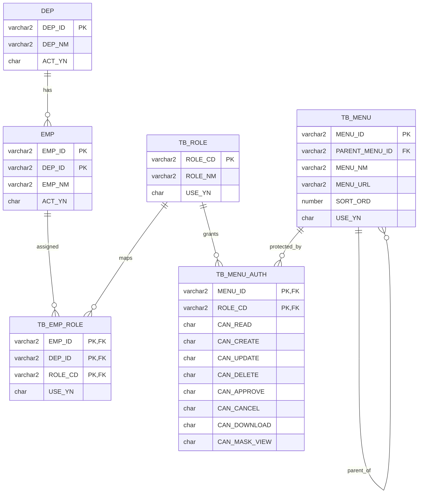

# 메뉴 / 역할 / 권한 테이블 설계

v3 권한 모델은 `EMP.PERM_*`를 사용하지 않는다.

사용자와 부서는 기존 운영 테이블을 사용한다.

```text
사용자: EMP
부서: DEP
```

신규 v3 권한 테이블은 다음 네 개로 설계한다.

```text
TB_ROLE
TB_EMP_ROLE
TB_MENU
TB_MENU_AUTH
```

## 설계 원칙

- `EMP`는 사람 정보만 담당한다.
- `DEP`는 부서 정보만 담당한다.
- `TB_ROLE`은 역할 코드와 역할명을 담당한다.
- `TB_EMP_ROLE`은 직원과 역할의 매핑을 담당한다.
- `TB_MENU`는 메뉴 트리와 URL을 담당한다.
- `TB_MENU_AUTH`는 역할별 메뉴 기능 권한을 담당한다.
- 메뉴 권한은 직원에게 직접 주지 않고 역할에 부여한다.
- 한 직원은 여러 역할을 가질 수 있다.
- 권한 판단 시 `EMP_ID` 단독 사용을 금지하고 `(EMP_ID, DEP_ID)`를 함께 사용한다.

## ERD



## TB_ROLE

역할 코드의 기준 테이블이다.

| 컬럼 | 타입 | 필수 | 설명 |
|---|---:|---|---|
| `ROLE_CD` | `VARCHAR2(30)` | Y | 역할 코드. Spring Security authority와 동일하게 사용 |
| `ROLE_NM` | `VARCHAR2(100)` | Y | 역할명 |
| `ROLE_DESC` | `VARCHAR2(500)` | N | 역할 설명 |
| `SORT_ORD` | `NUMBER(5)` | Y | 정렬순서 |
| `USE_YN` | `CHAR(1)` | Y | 사용 여부 |
| `REG_ID` | `VARCHAR2(12)` | Y | 등록자 |
| `REG_DTTM` | `TIMESTAMP(6)` | Y | 등록일시 |
| `UPD_ID` | `VARCHAR2(12)` | N | 수정자 |
| `UPD_DTTM` | `TIMESTAMP(6)` | N | 수정일시 |

기본 역할:

| 역할 | 용도 |
|---|---|
| `ROLE_ADMIN` | 시스템 관리자 |
| `ROLE_MANAGER` | 업무 관리자 |
| `ROLE_USER` | 일반 사용자 |
| `ROLE_VIEWER` | 조회 전용 사용자 |

## TB_EMP_ROLE

직원과 역할의 매핑 테이블이다.

| 컬럼 | 타입 | 필수 | 설명 |
|---|---:|---|---|
| `EMP_ID` | `VARCHAR2(12)` | Y | `EMP.EMP_ID` |
| `DEP_ID` | `VARCHAR2(12)` | Y | `EMP.DEP_ID` |
| `ROLE_CD` | `VARCHAR2(30)` | Y | `TB_ROLE.ROLE_CD` |
| `USE_YN` | `CHAR(1)` | Y | 사용 여부 |
| `REG_ID` | `VARCHAR2(12)` | Y | 등록자 |
| `REG_DTTM` | `TIMESTAMP(6)` | Y | 등록일시 |
| `UPD_ID` | `VARCHAR2(12)` | N | 수정자 |
| `UPD_DTTM` | `TIMESTAMP(6)` | N | 수정일시 |

기본키는 `(EMP_ID, DEP_ID, ROLE_CD)`다.

## TB_MENU

메뉴 트리와 화면 URL을 관리한다.

| 컬럼 | 타입 | 필수 | 설명 |
|---|---:|---|---|
| `MENU_ID` | `VARCHAR2(50)` | Y | 메뉴 ID |
| `PARENT_MENU_ID` | `VARCHAR2(50)` | N | 상위 메뉴 ID |
| `MENU_NM` | `VARCHAR2(100)` | Y | 메뉴명 |
| `MENU_URL` | `VARCHAR2(300)` | N | 화면 URL. 그룹 메뉴는 null |
| `MENU_LEVEL` | `NUMBER(2)` | Y | 메뉴 깊이 |
| `SORT_ORD` | `NUMBER(5)` | Y | 동일 부모 내 정렬순서 |
| `MENU_TYPE` | `CHAR(1)` | Y | `G`: 그룹, `M`: 화면 메뉴 |
| `ICON_NM` | `VARCHAR2(50)` | N | 아이콘명 |
| `DISPLAY_YN` | `CHAR(1)` | Y | 좌측 메뉴 표시 여부 |
| `USE_YN` | `CHAR(1)` | Y | 사용 여부 |
| `SYSTEM_YN` | `CHAR(1)` | Y | 시스템 보호 메뉴 여부 |
| `REMARK` | `VARCHAR2(500)` | N | 비고 |
| `REG_ID` | `VARCHAR2(12)` | Y | 등록자 |
| `REG_DTTM` | `TIMESTAMP(6)` | Y | 등록일시 |
| `UPD_ID` | `VARCHAR2(12)` | N | 수정자 |
| `UPD_DTTM` | `TIMESTAMP(6)` | N | 수정일시 |

규칙:

- 좌측 메뉴에는 `TB_MENU.DISPLAY_YN = 'Y'`, `TB_MENU.USE_YN = 'Y'`이고 `TB_MENU_AUTH.USE_YN = 'Y'`, `CAN_READ = 'Y'`인 메뉴만 노출한다.
- URL이 있는 메뉴는 `MENU_TYPE = 'M'`이어야 한다.
- URL이 없는 대메뉴는 `MENU_TYPE = 'G'`로 둔다.
- `MENU_URL`은 null을 제외하고 유일해야 한다.

## TB_MENU_AUTH

역할별 메뉴 기능 권한 테이블이다.

| 컬럼 | 타입 | 필수 | 설명 |
|---|---:|---|---|
| `MENU_ID` | `VARCHAR2(50)` | Y | `TB_MENU.MENU_ID` |
| `ROLE_CD` | `VARCHAR2(30)` | Y | `TB_ROLE.ROLE_CD` |
| `CAN_READ` | `CHAR(1)` | Y | 화면 접근, 목록/상세 조회 |
| `CAN_CREATE` | `CHAR(1)` | Y | 신규 등록 |
| `CAN_UPDATE` | `CHAR(1)` | Y | 수정 |
| `CAN_DELETE` | `CHAR(1)` | Y | 삭제 |
| `CAN_APPROVE` | `CHAR(1)` | Y | 승인/반려 |
| `CAN_CANCEL` | `CHAR(1)` | Y | 발송취소 등 취소성 업무 |
| `CAN_DOWNLOAD` | `CHAR(1)` | Y | 엑셀/파일 다운로드 |
| `CAN_MASK_VIEW` | `CHAR(1)` | Y | 개인정보 원문 또는 비마스킹 조회 |
| `USE_YN` | `CHAR(1)` | Y | 사용 여부 |
| `REG_ID` | `VARCHAR2(12)` | Y | 등록자 |
| `REG_DTTM` | `TIMESTAMP(6)` | Y | 등록일시 |
| `UPD_ID` | `VARCHAR2(12)` | N | 수정자 |
| `UPD_DTTM` | `TIMESTAMP(6)` | N | 수정일시 |

기본키는 `(MENU_ID, ROLE_CD)`다.

`USE_YN = 'N'`인 행은 해당 역할에 권한이 없는 것으로 판단한다.

## URL suffix 권한 매핑

| URL 패턴 | 필요 권한 |
|---|---|
| 화면 URL, `/data`, `/search`, `/detail`, `/tree` | `CAN_READ` |
| `/create`, `/register` | `CAN_CREATE` |
| `/update` | `CAN_UPDATE` |
| `/delete` | `CAN_DELETE` |
| `/approve`, `/reject` | `CAN_APPROVE` |
| `/cancel` | `CAN_CANCEL` |
| `/excel`, `/download`, `/export` | `CAN_DOWNLOAD` |
| `/unmask`, 개인정보 원문 조회 | `CAN_MASK_VIEW` |

등록과 수정은 `/create`, `/update`로 분리한다. 등록/수정 겸용 `/save` endpoint는 v3 신규 코드에서 만들지 않는다. legacy 호환으로 `/save`를 유지해야 하는 경우 `CAN_CREATE`와 `CAN_UPDATE`를 모두 요구한다.

서버는 좌측 메뉴 표시와 별도로 URL/API 요청 시 권한을 다시 검증해야 한다.

## EMP.PERM_*와의 관계

`EMP.PERM_*`는 v3 권한 판단에 사용하지 않는다.

초기 이관 시 참고할 수는 있지만, 로그인 후 메뉴 노출과 API 권한 판단은 반드시 `TB_EMP_ROLE`, `TB_MENU_AUTH`만 사용한다.
